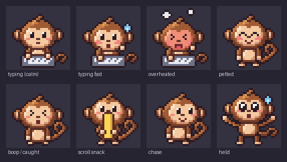

# Mouse Monkey

A tiny pixel-art monkey that lives on your desktop. He watches your cursor, types along
when you type, purrs when you pet him, and gets thrown around when you fling him.

Inspired by [Comnyang](https://comnyang.com/en), the desktop cat.



## Interactions

### Mouse

| What you do | What he does |
|---|---|
| **Move the cursor** | Follows it with his eyes, turning his head toward it in 8 directions. |
| **Click him** (quick click, don't drag) | Boop! He squeezes his eyes shut, giggles and does a little hop. |
| **Drag him** | Gets picked up by the scruff, legs dangling. He stretches like mochi as you move him, more when you move faster, and wobbles back into shape when you let go. |
| **Throw him** (let go mid-flick) | Tumbles through the air, bounces off the screen edges and lands on the bottom of the screen. |
| **Stroke his head** (move the cursor side to side over it a few times) | Closes his eyes and purrs, with little hearts floating up. Keeps purring as long as you keep petting. |
| **Whip the cursor across the screen** | Runs after it. If he catches it he celebrates, then takes a short breather before he'll chase again. |
| **Leave the mouse alone for 5 minutes** | Wanders over to wherever the cursor is resting. |
| **Scroll** (mouse wheel or two fingers on a touchpad) | Peels a banana a little with every notch of the wheel (about 12 notches), then eats it. Stop scrolling for a few seconds and he puts it away. |

### Keyboard

| What you do | What he does |
|---|---|
| **Type anywhere** | Sits at his own tiny keyboard and presses a paw for every key, alternating left and right. The key he hits lights up. |
| **Press Space or Enter** | Thumps the keyboard with both paws. |
| **Type fast** (about 5+ keys a second) | Gets flushed and starts to sweat. |
| **Type really fast** (about 8+ keys a second) | Overheats: he turns red, squeezes his eyes shut and steam puffs from his head. He cools down again when you slow down. |
| **Stop typing** | Goes back to what he was doing after a second and a half. |

All of these work no matter which window is active. He only takes clicks and scrolls
on his own body; everywhere else they go to the window underneath, as usual.

When he's idle he breathes, sways his tail and occasionally does a little wiggle.

## Requirements

- **Linux with Wayland**, and a compositor that supports the layer-shell protocol, e.g.
  COSMIC (Pop!_OS), KDE Plasma, Sway or Hyprland. GNOME doesn't support it, so the monkey
  won't appear there.
- **Rust**: install from [rustup.rs](https://rustup.rs).
- **Build dependencies** (Debian/Ubuntu/Pop!_OS package names):
  ```bash
  sudo apt install pkg-config libxkbcommon-dev libwayland-dev
  ```
- **Access to input devices.** Wayland doesn't let apps see typing, scrolling or mouse
  movement in other windows, so the monkey reads your keyboard, mouse and touchpad from
  `/dev/input` directly. Add yourself to the `input` group, then **log out and back in**
  (a new terminal isn't enough):
  ```bash
  sudo usermod -aG input $USER
  ```
  To try it straight away without logging out, start him with
  `sg input -c "cargo run --release"` instead. Without this access he can still be
  clicked, dragged and petted, but he won't react to typing or scrolling, and he only
  notices the cursor while it's over him. He prints which access he has every time he
  starts.

Windows support is not working yet.

## Running

### The easy way: an app icon

Run this once from the project folder:

```bash
./install.sh
```

It builds the app and adds a **Mouse Monkey** icon to your app menu and your desktop.
After that:

- **Double-click the icon** (or open it from the app menu) to bring him out.
- **Open it again** to send him home.
- Or **right-click the icon** and choose **Send Him Home (Quit)**.

Pin it to your dock or panel for one-click access. It also adds a `mouse-monkey`
terminal command that does the same thing (`mouse-monkey`, `mouse-monkey stop`).

If you change the code, the icon rebuilds the app the next time you open it (you'll
get a notification while it builds). Other options:

```bash
./install.sh --autostart   # also start him when you log in
./install.sh --uninstall   # remove the icons, the command and autostart
```

If you move the project folder, run `./install.sh` again. If he doesn't appear, the
app's output is in `$XDG_RUNTIME_DIR/mouse-monkey.log` (usually
`/run/user/1000/mouse-monkey.log`).

### From a terminal

From the project folder (the config and sprite paths are relative to it):

```bash
cargo run --release
```

He appears in the middle of the screen. Press **Ctrl+C** in the terminal to quit.

To see what he's doing and why, turn on logging:

```bash
RUST_LOG=info cargo run --release
```

At startup this lists every input device and what it's used for
(`evdev: /dev/input/event3: … (keyboard)`); the first key press prints
`evdev: receiving key presses from <device>`, and state changes
print lines like `Monkey: typing along.`, `Monkey: chasing the cursor.` or
`Monkey: landed.`

## Troubleshooting

- **He doesn't react to typing or scrolling.** Look at the `Mouse Monkey input access`
  lines he prints on start; if something says `NOT AVAILABLE`, they tell you how to fix
  it. To test your devices directly, run:
  ```bash
  cargo run --release -- --check-input
  ```
  It lists every input device, then listens for 10 seconds while you type, move the
  mouse or touchpad and scroll, and reports which of those it received.
- **No monkey appears at all.** Your compositor probably doesn't support layer-shell
  (e.g. GNOME).
- **`git status` shows lots of changes under `target/`.** The build folder is committed
  to the repo, so every build modifies it. Those changes are safe to discard with
  `git checkout -- target`.

## Configuration

Settings live in `monkey_companion.toml`:

| Setting | Meaning |
|---|---|
| `tick_rate_hz` | Updates per second (default 60). |
| `sprite.sheet_path` | The sprite sheet to load. |
| `sprite.frame_width`, `sprite.frame_height` | Size of one animation frame on the sheet (128 × 128). |
| `window_width`, `window_height` | Initial overlay size; the compositor resizes it to fit your screen. |

## Development

Run the tests (no display needed):

```bash
cargo test
```

The behaviour tests in `src/monkey.rs` drive the monkey with simulated mouse, keyboard
and scroll input, covering each interaction above.

### Project layout

| Path | What's there |
|---|---|
| `src/monkey.rs` | The monkey's behaviour: states, timers, physics and which animation frame to show. |
| `src/wayland.rs` | Linux driver: the transparent overlay, rendering, reading input from `/dev/input`, and `--check-input`. |
| `src/touchpad.rs` | Turns touchpad finger positions into cursor motion and two-finger scrolling. |
| `src/platform.rs` | The input events and driver interface shared by all platforms. |
| `src/sprite_renderer.rs` | Loads and validates the sprite sheet. |
| `mouse-monkey.sh` | Starts or stops the app, rebuilding it first if the code changed. |
| `install.sh` | Adds the app menu/desktop icon, the `mouse-monkey` command and optional autostart. |
| `assets/icon.png` | The app icon (the first frame of the animation sheet, scaled up). |
| `assets/sprites/` | `monkey_directional.png` (the animation sheet the app uses) and `monkey_brown.png` (a sheet of 16 emotes). |
| `tools/sprites/` | The pixel art source that generates both sprite sheets. |

### Editing the sprites

The sprites are hand-drawn pixel art written as text grids in `tools/sprites/`, where
each letter is a palette colour. After editing, rebuild the sheets (needs Python 3 and
Pillow):

```bash
sudo apt install python3-pil
python3 tools/sprites/build.py
```

The animation sheet is 8 columns × 14 rows of 128 px frames. `tools/sprites/build.py`
documents what each row is for, and the row numbers must match the `ROW_*` constants in
`src/monkey.rs`.
